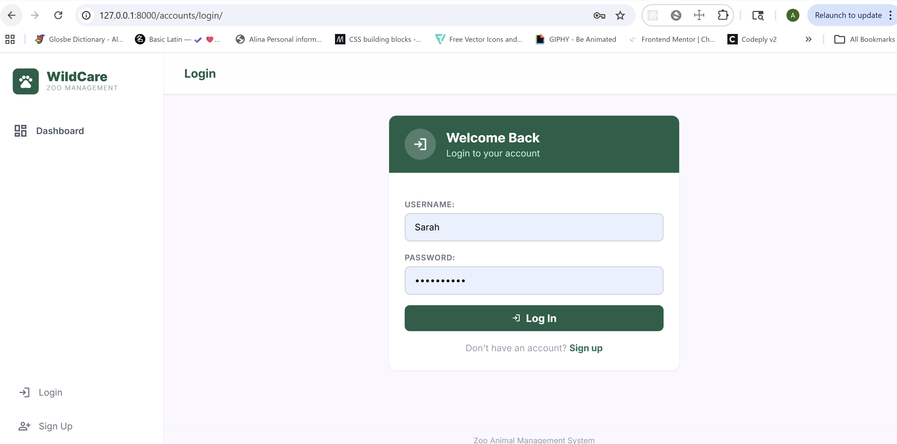
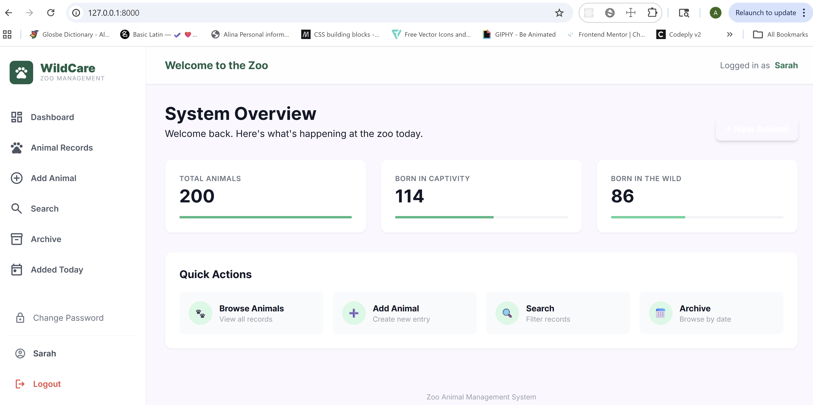
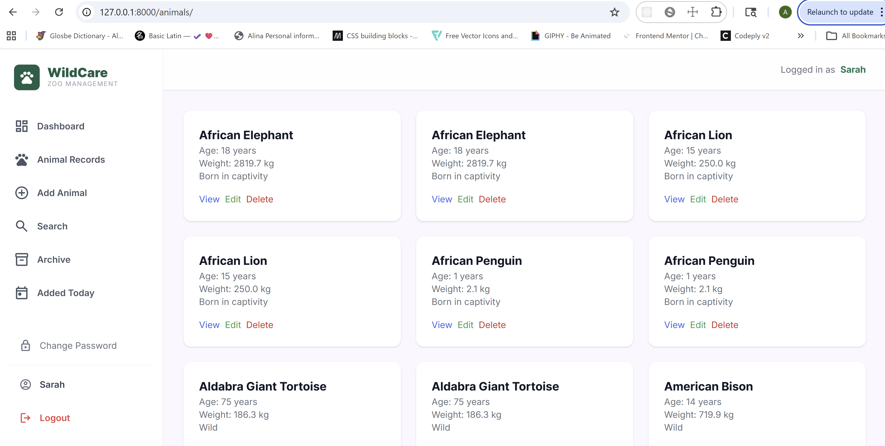
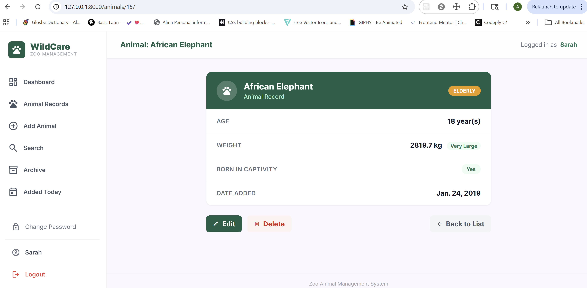
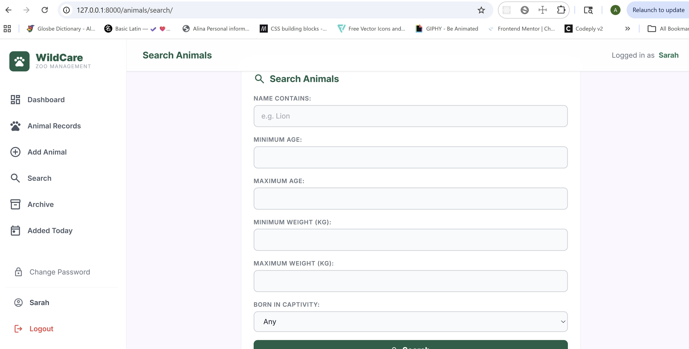
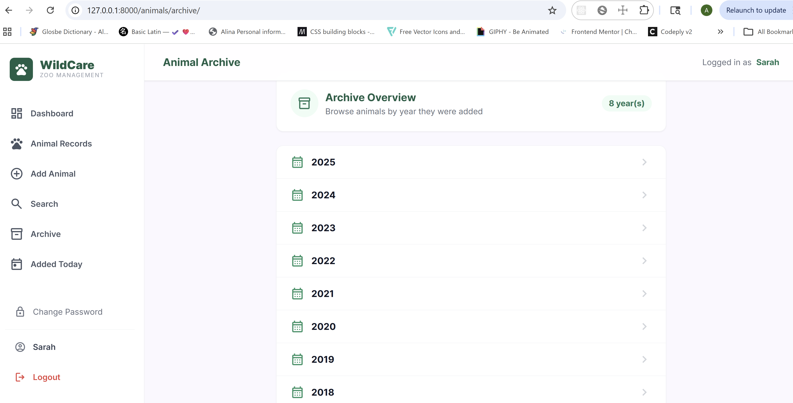
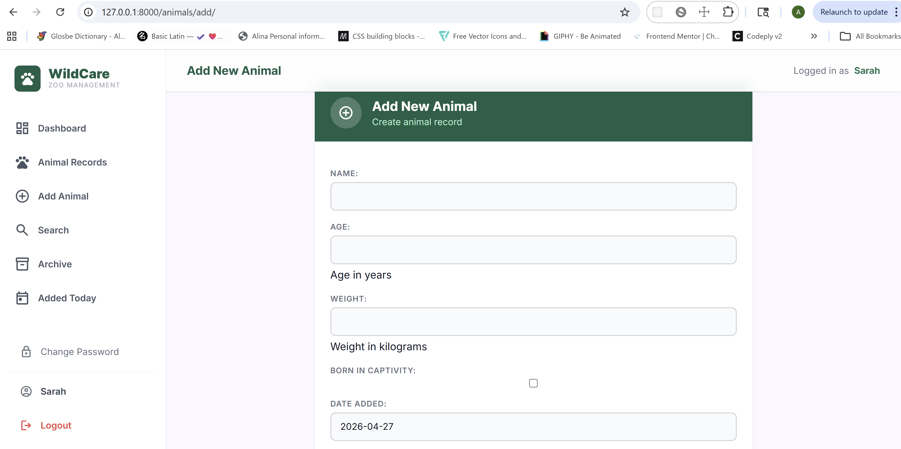

#  WildCare — Zoo Animal Management System

## 📌 Overview

A Django web application for managing zoo animals. The system supports full CRUD operations, date-based archives, animal search, and user authentication — all wrapped in a clean WildCare dashboard created by Google Stitch.

---

## 🚀 Features

- Browse, add, edit, and delete animal records
- Search and filter animals by name, age, weight, and captivity status
- Date-based archive (by year, month, week, and day)
- User authentication (login, logout, sign up, change password)
- Protected pages using `LoginRequiredMixin` and `@login_required`
- Class-based views (ListView, DetailView, CreateView, UpdateView, DeleteView, FormView, ArchiveIndexView, and more)
- WildCare dashboard UI with sidebar navigation

---


## Setup Instructions

### 1. Clone the repository

```bash
git clone <your-repo-url>
cd zoo_project
```

### 2. Create and activate virtual environment

```bash
python -m venv venv
venv\Scripts\activate        # Windows
source venv/bin/activate     # Mac/Linux
```

### 3. Install dependencies

```bash
pip install django
```

### 4. Apply migrations

```bash
python manage.py migrate
```

### 5. Create a superuser (optional)

```bash
python manage.py createsuperuser
```

### 6. Run the development server

```bash
python manage.py runserver
```

### 7. Open in browser

```
http://127.0.0.1:8000/
```

---

## 📸 Preview

### Login


### Dashboard


### Animal List


### Animal Detail


### Search


### Archive


### Add Animal
